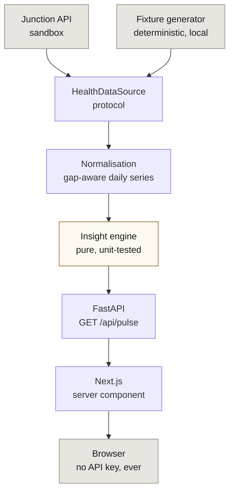

# Health Pulse

A one-day full-stack prototype built on [Junction's](https://docs.junction.com) health-data API.
It answers a single question:

> **What has changed in this patient's recent health data?**

Rather than rendering every available wearable metric, Health Pulse compares a recent 7-day
window against the preceding 21-day baseline, reports only the changes that cross a threshold,
and shows exactly how each number was derived.

> [!IMPORTANT]
> This prototype is for demonstration purposes and is not a medical diagnostic tool.


## The evidence view

The interesting part is not the 18%. It is that the 18% can be checked.

Every insight opens into the two averages behind it, the arithmetic between them, how many days
each average actually covers, and which Junction field the numbers were read from.


Those figures are computed server-side in the same request as the headline, so the explanation
cannot disagree with the claim it explains.

## Architecture

The browser never holds the Junction API key. It talks only to the FastAPI service, which talks
to Junction.



`HealthDataSource` is a `Protocol` with two methods. The live Junction client and the local
fixture generator both satisfy it, which is what lets the app run and be fully tested before any
credentials exist — and switch to live sandbox data with no code change.

## Running it

The app runs immediately after a clone, on generated data. No Junction account needed to see it
work.

**Backend** — from `backend/`:

```bash
python -m venv .venv && .venv/bin/pip install -r requirements-dev.txt && .venv/bin/uvicorn app.main:app --reload
```

**Frontend** — from `frontend/`:

```bash
npm install && npm run dev
```

Then open <http://localhost:3000>. `GET /health` reports which data source is active, so a
running instance is self-describing.

### Pointing it at Junction

1. Create a sandbox key in the Junction dashboard and put it in `backend/.env`:

   ```bash
   cp backend/.env.example backend/.env   # then set JUNCTION_API_KEY
   ```

2. Create a demo patient. This calls `POST /v2/user/` and then `POST /v2/link/connect/demo`,
   which Junction backfills with 30 days of synthetic data:

   ```bash
   curl -X POST http://localhost:8000/api/demo/provision
   ```

3. Put the returned `user_id` in `backend/.env` as `JUNCTION_USER_ID` and restart.

The service switches to live data automatically once both values are present. Junction's demo
users expire after seven days, so step 2 is occasionally worth repeating.

## Junction endpoints used

| Endpoint | Purpose |
| --- | --- |
| `POST /v2/user/` | Create the demo patient |
| `POST /v2/link/connect/demo` | Attach a synthetic provider connection (30 days backfilled) |
| `GET /v2/summary/sleep/{user_id}` | Nightly sleep sessions |
| `GET /v2/summary/activity/{user_id}` | Daily activity and heart-rate rollups |

Authentication is the `x-vital-api-key` header. The host must match your team's region or every
request returns 401 `invalid token`, which looks identical to a bad key: `sk_eu_` keys need
`api.sandbox.eu.junction.com`, `sk_us_` keys need `api.sandbox.us.junction.com`.

Demo connections are sandbox-only and expose data in Summary format, so the prototype reads
summaries rather than raw or stream structures.

## How the insight is calculated

```text
        anchor = last day with data
                        │
   ┌────────────────────┴──────────────┐
   │        21-day baseline            │  7-day recent  │
   └───────────────────────────────────┴────────────────┘

        (recent mean − baseline mean) / baseline mean × 100
```

| Result | Verdict |
| --- | --- |
| `> +10%` | Increased |
| `< −10%` | Decreased |
| otherwise | Stable |
| coverage below 70% | Not enough data |

Worked example, from the generated patient:

```text
Previous 21-day average    7h 40m   (19 of 21 days recorded)
Recent 7-day average       6h 18m   (7 of 7 days recorded)
Change                     −18%
```

These are prototype thresholds, not clinical ones.

Deliberately arithmetic rather than a model. If the app claims sleep is down 18%, the user should
be able to check that figure — a learned score cannot offer that, and for a prototype touching
health data, being auditable matters more than being clever.

## Handling real-world data

Wearable data is not a complete time series, and most of the engineering here is about that.

**Missing days are gaps, never zeros.** A week containing two unworn nights would otherwise show
a large sleep "decrease" that is really an absence of measurement. Every mean is taken over
observed days only, and coverage is reported alongside it. A recorded zero-step day, by contrast,
is real data and is kept. There is a test for this specific regression.

**Provider coverage varies.** Junction normalises across 300+ devices, but that does not mean
every field is populated every night. Resting heart rate resolves through an ordered chain —
`hr_resting` → `hr_lowest` → `hr_average`, then the daily activity rollup — and the field actually
used is counted per window and surfaced in the evidence view. On the generated patient that reads
`hr_resting (22d), hr_lowest (4d)`.

**The window is anchored on the last day with data, not on today.** A device that has not synced
since yesterday would otherwise drag an empty day into the recent window and read as a decline.

**Sleep is per session, not per night.** Junction returns a record per sleep session, so
fragmented nights are summed and naps excluded — unless naps are all a day has, in which case
they are used and labelled.

**"Not enough data" is a verdict, not a blank.** It carries a reason, because "the device was not
worn enough" and "there is no history yet" are different situations for the reader.

All of the above was designed against the documented schema and then checked against a live EU
sandbox connection, which corrected one real mistake and promoted one defensive guess into a
load-bearing feature — see [decision 12](docs/DECISIONS.md). Junction's sandbox backfills 30 days
of activity but only 11 nights of sleep, so on live data sleep and resting heart rate report "not
enough data" while activity compares normally. That is the coverage guard working, not a bug.

## Product decisions

The full set is in [docs/DECISIONS.md](docs/DECISIONS.md). The ones that shaped the most code:

- **One question, not a dashboard.** The screen answers "what changed?" rather than displaying
  every metric Junction exposes.
- **Deterministic, not AI.** So every figure is inspectable.
- **Direction is never colour-coded.** Rendering "sleep down 18%" in red would assert that the
  change is bad — a clinical reading a 10% threshold cannot support. Verdicts share one neutral
  ink, and the single accent is reserved for "worth reviewing", which is about attention rather
  than health.
- **Describe, do not diagnose.** All wording lives in one reviewed module, and a test asserts the
  generated sentences contain no clinical or advisory language.

## Project layout

```text
backend/
├── app/
│   ├── junction/     API client, response models, fixture generator, source protocol
│   ├── domain/       gap-aware series, metric extraction, insight engine, wording
│   ├── services/     orchestration
│   ├── api/          routes, wire schemas, dependencies
│   ├── config.py     analysis window and thresholds in one place
│   └── errors.py     one error per failure mode
└── tests/            124 tests

frontend/
├── app/              server component page, design tokens
├── components/       metric cards, change card, evidence panel, chart, state views
└── lib/              typed API client, formatters, chart theme
```

## Tests

```bash
cd backend && .venv/bin/pytest -q      # 124 tests
cd frontend && npm test                # 21 tests
```

CI runs ruff, `ruff format --check`, strict mypy and pytest for the backend, and eslint, `tsc`,
vitest and `next build` for the frontend.

No Junction credentials are needed: the suite runs against the fixture source. Schema assumptions
are still covered rather than skipped — the client tests parse Junction's own documented example
payloads, so a change in the published schema surfaces as a failing test rather than a runtime
surprise.

## What this deliberately is not

No database, no authentication, no queue, no AI model, no deployment infrastructure. A one-day
prototype does not need them, and adding them would have crowded out the part worth building.

Missing for the same reason: multi-provider aggregation, webhook-driven refresh, per-metric
thresholds, and any persistence of computed insights.

## What I would explore next

Junction's Sense product aggregates and normalises device data server-side. A good deal of the
normalisation in `app/domain/` — the fallback chains, the session-to-night rollup — is arguably
work that belongs there rather than in an application. Establishing where that line should sit is
the first thing I would want to test with more time.

## Licence

[MIT](LICENSE)
