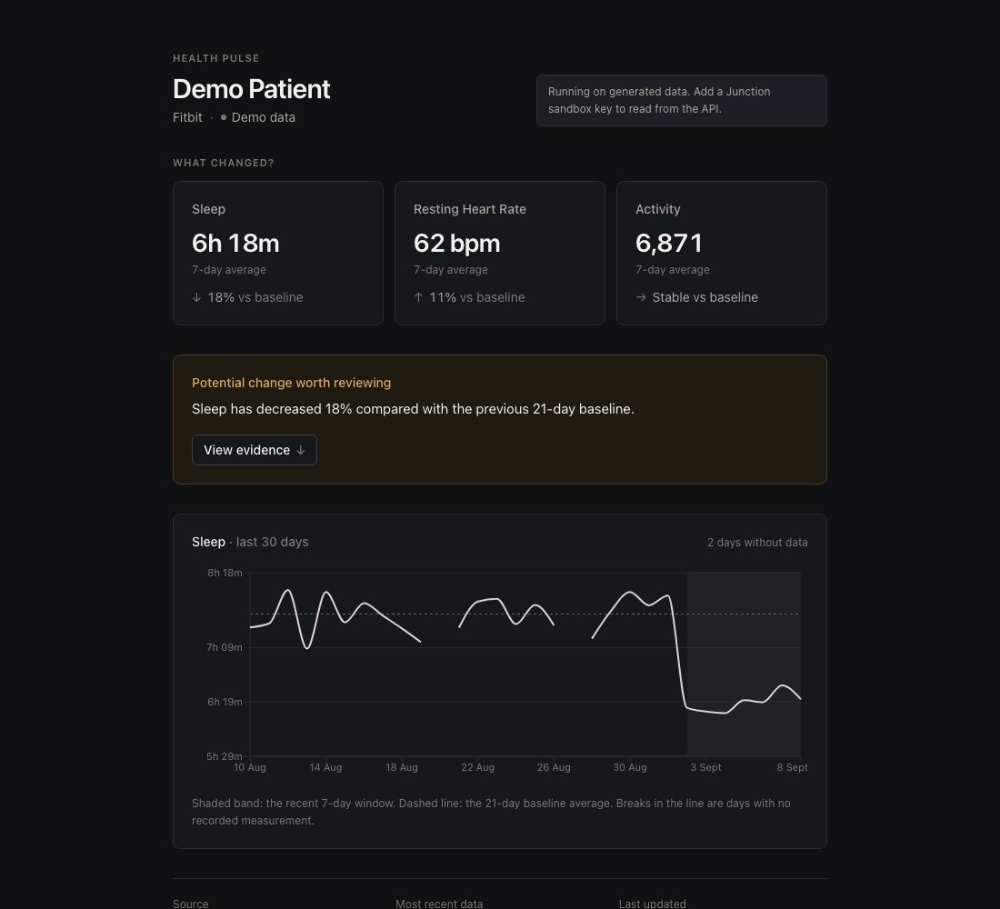
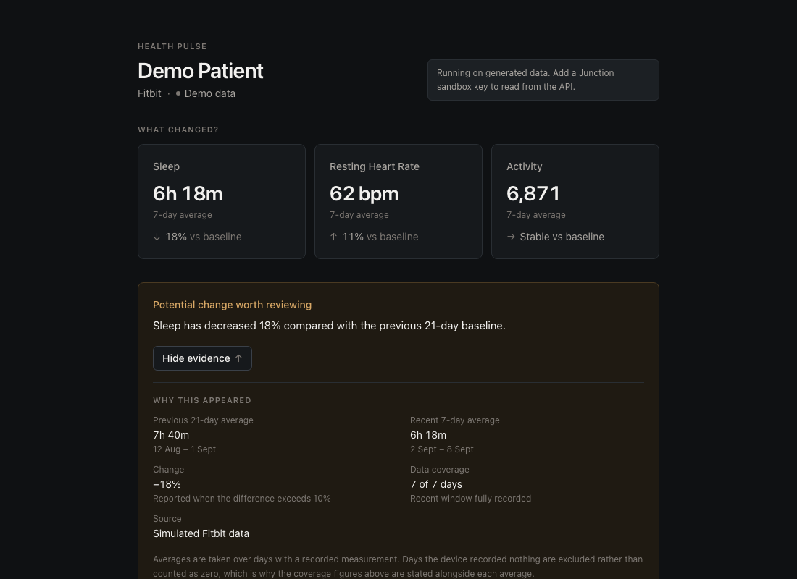
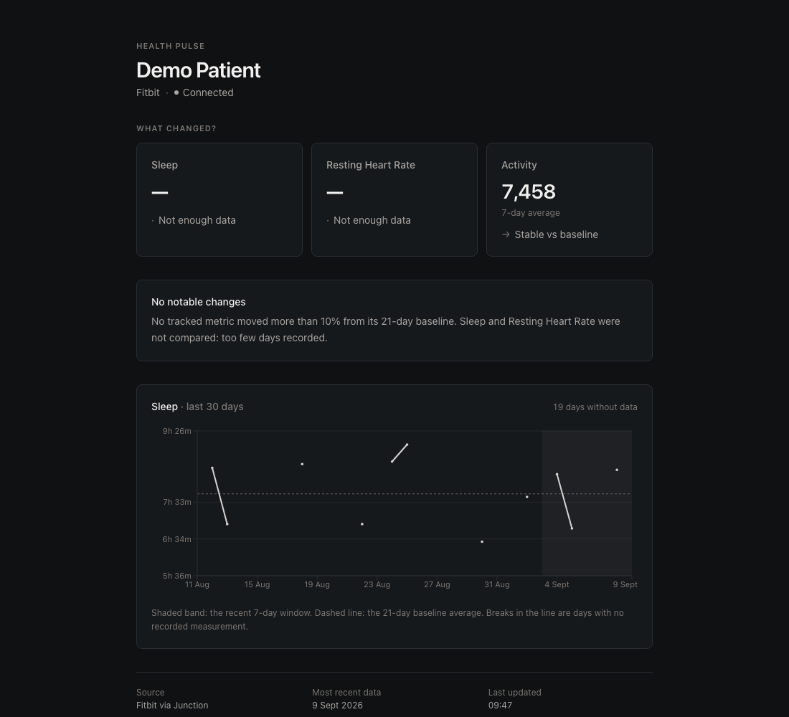
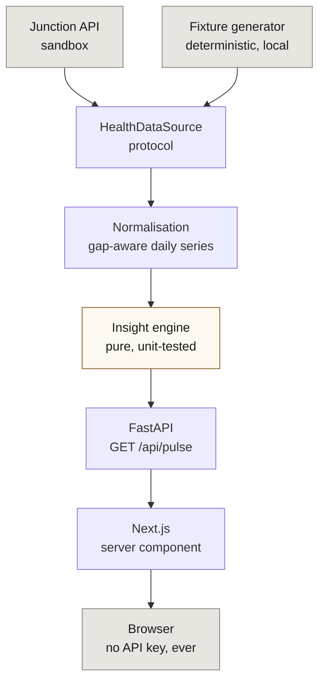

# Health Pulse

A one-day full-stack prototype on [Junction's](https://docs.junction.com) health-data API. It
answers one question:

> **What has changed in this patient's recent health data?**

Instead of showing every metric Junction exposes, it compares a recent 7-day window against the
21 days before it, reports only the changes above a threshold, and shows how each number was
worked out.

> [!IMPORTANT]
> This prototype is for demonstration purposes and is not a medical diagnostic tool.



## The evidence view

The interesting part isn't the 18%. It's that the 18% can be checked.

Every insight opens into the two averages behind it, the arithmetic between them, how many days
each average actually covers, and which Junction field the numbers came from.



Those figures get computed server-side in the same request as the headline, so the explanation
can't disagree with the claim it explains.

## On live Junction data

The same app against a live EU sandbox connection. Junction backfills 30 days of activity but
only 11 nights of sleep, so sleep and resting heart rate say "not enough data" while activity
compares normally. The headline names what it couldn't assess instead of claiming every metric
was within threshold. Single measurements get drawn as points, since a day whose neighbours are
missing has no line segment to sit on.



That's the coverage guard doing its job. A 33% baseline shouldn't produce a confident comparison,
and it's the one result the generated patient couldn't have produced, since that patient was
built with enough coverage to pass.

## Architecture

The browser never holds the Junction API key. It only talks to the FastAPI service, which talks
to Junction.



`HealthDataSource` is a `Protocol` with two methods. The live Junction client and the local
fixture generator both satisfy it. That's what lets the app run and be tested with no credentials,
then switch to live sandbox data without a code change.

## Running it

It runs straight after a clone, on generated data. You don't need a Junction account to see it
work.

### Requirements

**Python 3.11 or newer** and **Node 20 or newer**. Check both first:

```bash
python3 --version && node --version
```

If `python3` reports 3.9 or 3.10, install a newer one (`brew install python@3.12`) and call that
executable by name below. macOS ships 3.9 as `/usr/bin/python3`, and `python` is often aliased to
it, so `python -m venv` can quietly build the environment on 3.9. That's why the commands below
say `python3`, and why the package refuses to import on anything older.

### Backend

From `backend/`:

```bash
python3 -m venv .venv && .venv/bin/pip install -r requirements-dev.txt
```

```bash
.venv/bin/uvicorn app.main:app --reload
```

Swap in a specific interpreter if your default `python3` is too old, for example
`python3.12 -m venv .venv`.

### Frontend

From `frontend/`, in a second terminal:

```bash
npm install && npm run dev
```

Then open <http://localhost:3000>. `GET /health` says which data source is active, so a running
instance describes itself.

The frontend looks for the API at `http://localhost:8000`. If yours runs elsewhere, set
`HEALTH_PULSE_API_URL` in `frontend/.env`. Start the backend first, or the page shows a "backend
unreachable" state instead of data.

### Pointing it at Junction

1. Create a sandbox key in the Junction dashboard and put it in `backend/.env`:

   ```bash
   cp backend/.env.example backend/.env   # then set JUNCTION_API_KEY
   ```

2. Create a demo patient. This calls `POST /v2/user/` and then `POST /v2/link/connect/demo`,
   which Junction backfills with 30 days of synthetic data:

   ```bash
   curl -X POST http://localhost:8000/api/demo/provision
   ```

3. Put the returned `user_id` in `backend/.env` as `JUNCTION_USER_ID` and restart.

The service switches to live data on its own once both values are there. Junction's demo users
expire after seven days, so step 2 is worth repeating now and then.

## Junction endpoints used

| Endpoint | Purpose |
| --- | --- |
| `POST /v2/user/` | Create the demo patient |
| `POST /v2/link/connect/demo` | Attach a synthetic provider connection (30 days backfilled) |
| `GET /v2/summary/sleep/{user_id}` | Nightly sleep sessions |
| `GET /v2/summary/activity/{user_id}` | Daily activity and heart-rate rollups |

Auth is the `x-vital-api-key` header. The host has to match your team's region or every request
comes back 401 `invalid token`, which looks exactly like a bad key: `sk_eu_` keys need
`api.sandbox.eu.junction.com`, `sk_us_` keys need `api.sandbox.us.junction.com`.

Demo connections are sandbox-only and give data in Summary format, so the prototype reads
summaries rather than raw or stream structures.

## How the insight is calculated

```text
        anchor = last day with data
                        │
   ┌────────────────────┴──────────────┐
   │        21-day baseline            │  7-day recent  │
   └───────────────────────────────────┴────────────────┘

        (recent mean − baseline mean) / baseline mean × 100
```

| Result | Verdict |
| --- | --- |
| `> +10%` | Increased |
| `< −10%` | Decreased |
| otherwise | Stable |
| coverage below 70% | Not enough data |

Worked example, from the generated patient:

```text
Previous 21-day average    7h 40m   (19 of 21 days recorded)
Recent 7-day average       6h 18m   (7 of 7 days recorded)
Change                     −18%
```

These are prototype thresholds, not clinical ones.

It's arithmetic rather than a model on purpose. If the app says sleep is down 18%, you should be
able to check that figure yourself. A learned score can't offer that, and for a prototype
touching health data, being auditable matters more than being clever.

## Dealing with incomplete data

Wearable data isn't a complete time series, and most of the engineering here is about that.

**Missing days are gaps, never zeros.** A week with two unworn nights would otherwise show a big
sleep "decrease" that's really just missing measurement. Every mean is taken over observed days
only, with coverage reported next to it. A recorded zero-step day is a different thing: that's
real data, and it's kept. There's a test for this exact regression.

**Providers don't fill in the same fields.** Junction normalises across 300+ devices, which
doesn't mean every field arrives every night. Resting heart rate resolves through an ordered chain
(`hr_resting`, then `hr_lowest`, then `hr_average`, then the daily activity rollup), and the field
actually used gets counted per window and shown in the evidence view. On the generated patient
that reads `hr_resting (22d), hr_lowest (4d)`.

**The window anchors on the last day with data, not on today.** A device that hasn't synced since
yesterday would otherwise pull an empty day into the recent window and read as a decline.

**Sleep arrives per session, not per night.** Junction returns one record per sleep session, so
fragmented nights get summed and naps left out. If naps are all a day has, they're used and
labelled. Naps are decided by duration rather than by the provider's label, since Fitbit's data
puts eight-hour nights under `short_sleep`.

**"Not enough data" is a verdict, not a blank.** It carries a reason, since "the device wasn't
worn enough" and "there's no history yet" are different situations for the reader.

All of that was written against the documented schema and then checked against a live EU sandbox
connection, which found three real bugs and turned one defensive guess into the thing holding a
metric up. [Decision 12](docs/DECISIONS.md) has the details.

## Product decisions

The full set is in [docs/DECISIONS.md](docs/DECISIONS.md). The ones that shaped the most code:

- **One question, not a dashboard.** The screen answers "what changed?" rather than listing every
  metric Junction exposes.
- **Deterministic, not AI.** So every figure can be inspected.
- **Direction is never colour-coded.** Showing "sleep down 18%" in red would claim the change is
  bad, which a 10% threshold can't support. Verdicts share one neutral ink, and the single accent
  colour is kept for "worth reviewing", which is about attention rather than health.
- **Describe, don't diagnose.** All the wording sits in one module, and a test checks the
  generated sentences carry no clinical or advisory language.

## Project layout

```text
backend/
├── app/
│   ├── junction/     API client, response models, fixture generator, source protocol
│   ├── domain/       gap-aware series, metric extraction, insight engine, wording
│   ├── services/     wiring between the client and the domain
│   ├── api/          routes, wire schemas, dependencies
│   ├── config.py     analysis window and thresholds in one place
│   └── errors.py     one error per failure mode
└── tests/            134 tests

frontend/
├── app/              server component page, design tokens
├── components/       metric cards, change card, evidence panel, chart, state views
└── lib/              typed API client, formatters, chart theme
```

## Tests

```bash
cd backend && .venv/bin/pytest -q      # 134 tests
cd frontend && npm test                # 21 tests
```

CI runs ruff, `ruff format --check`, strict mypy and pytest for the backend, then eslint, `tsc`,
vitest and `next build` for the frontend.

No Junction credentials needed: the suite runs against the fixture source. Schema assumptions
still get covered rather than skipped, since the client tests parse Junction's own documented
example payloads. A change in the published schema shows up as a failing test rather than a
surprise at runtime.

## What this deliberately isn't

No database, no auth, no queue, no AI model, no deployment setup. A one-day prototype doesn't
need them, and adding them would have squeezed out the part worth building.

Left out for the same reason: multi-provider aggregation, webhook-driven refresh, per-metric
thresholds, and any storage of computed insights.

## What I'd look at next

Junction's Sense product aggregates and normalises device data server-side. A fair amount of the
normalisation in `app/domain/`, the fallback chains and the session-to-night rollup, is probably
work that belongs there rather than in an application. Working out where that line sits is the
first thing I'd want to test with more time.

## Licence

[MIT](LICENSE)
